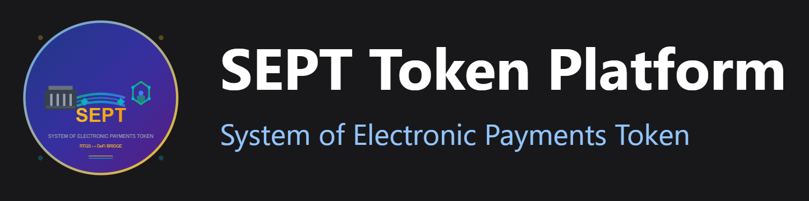

# RTGS (ISO 20022) × ETH (ERC-20): **SEPT** (Hoodi testnet)



[](#)

[](https://hoodi.etherscan.io/address/0x8e0F02D4Afc9DEB5AeB23eEeb1676505d1d38789#code)

[](https://repo.sourcify.dev/contracts/full_match/560048/0x8e0F02D4Afc9DEB5AeB23eEeb1676505d1d38789/)

```text
888    888                      888 888               888
888    888                      888 888               888
888    888                      888 888               888
8888888888  8888b.  888d888 .d88888 88888b.   8888b.  888888
888    888     "88b 888P"  d88" 888 888 "88b     "88b 888
888    888 .d888888 888    888  888 888  888 .d888888 888
888    888 888  888 888    Y88b 888 888  888 888  888 Y88b.
888    888 "Y888888 888     "Y88888 888  888 "Y888888  "Y888
```

Цей проєкт є варіантом Minimum Viable Product (MVP) у сфері інтеграції світів RTGS та DeFi. MVP використовує тестову мережу ETH (Hoodi), не містить підтримку hardware гаманців, мультипідписів, повної адаптації з ISO 20022, вибір оптимального L2 ETH,  тощо. Мета MVP більше про актуальність теми.

Для отримання ролі у цьому контракті (результат деплою та верифікації нижче, для тесту створіть новий аккаунт Metamask, яущо історія транзакцій важлива), тестових токенів SEPT, доступ до фронтенду смарт контракту та і якщо вам цікава ця тема - звертайтеся. Звісно, можете розгорнути смарт контракт для себе і поадмінити :) (проєкт будував на HardHat, тести, деплой, фронтенд React теж там. Скрипти тестів, деплою та фронтенду у разі потреби також можу надати - наразі вони у приватній частині GitHub). Повний паблік усього цього наразі не додаю, оскільки тема навряд чи сьогодні зацікавить дуже широке коло фахівців

---

## Контракт

- **Файл:** `contracts/SEPT.sol`  
- **Адреса (Hoodi, chainId `560048`):** `0x8e0F02D4Afc9DEB5AeB23eEeb1676505d1d38789`  
- **Ім’я/Символ/Дробність:** `sept` / `SEPT` / `2`  
- **Експлорери:**  
  - Etherscan: https://hoodi.etherscan.io/address/0x8e0F02D4Afc9DEB5AeB23eEeb1676505d1d38789#code  
  - Sourcify: https://repo.sourcify.dev/contracts/full_match/560048/0x8e0F02D4Afc9DEB5AeB23eEeb1676505d1d38789/

---

## Верифікація та збірка

- **Верифіковано:** Etherscan + Sourcify  
- **Компілятор:** Solidity `0.8.28`  
- **Налаштування:** `optimizer { enabled: true, runs: 200 }`, `viaIR: true`  
- **Аргументи конструктора:** `"sept"`, `"SEPT"`

---

## 🔧 ABI та швидкий старт

ABI доступний у файлі `abi/Token1.json`.


## 🦊 Додати токен у MetaMask

- **Token Address:** `0x8e0F02D4Afc9DEB5AeB23eEeb1676505d1d38789`  
- **Token Symbol:** `SEPT`  
- **Decimals:** `2`

---

## ℹ️ Примітки

- Мережа: **Hoodi testnet** (`chainId: 560048`, RPC: `https://ethereum-hoodi-rpc.publicnode.com`).  
- Скрипти тестів та фронтенд залишаються приватними за потреби звертайтесь для отримання доступу або демонстрації.
